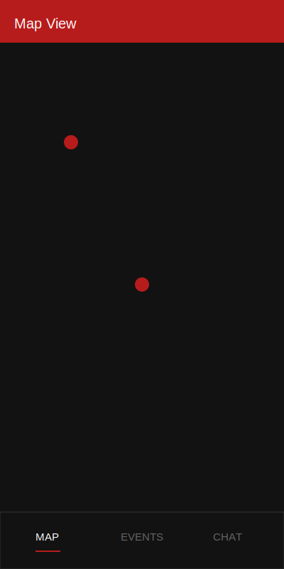
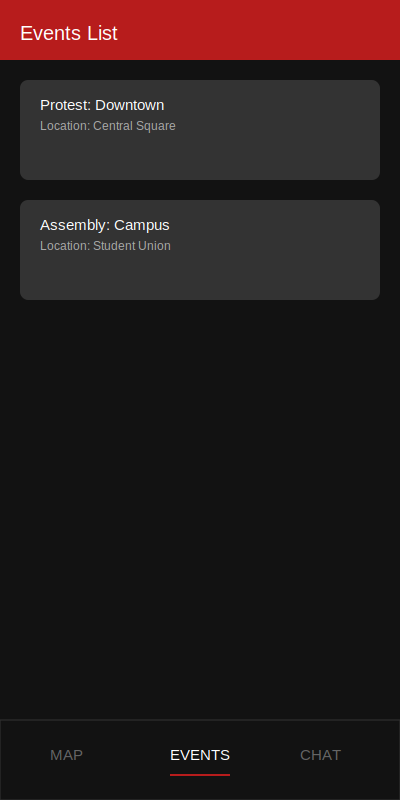
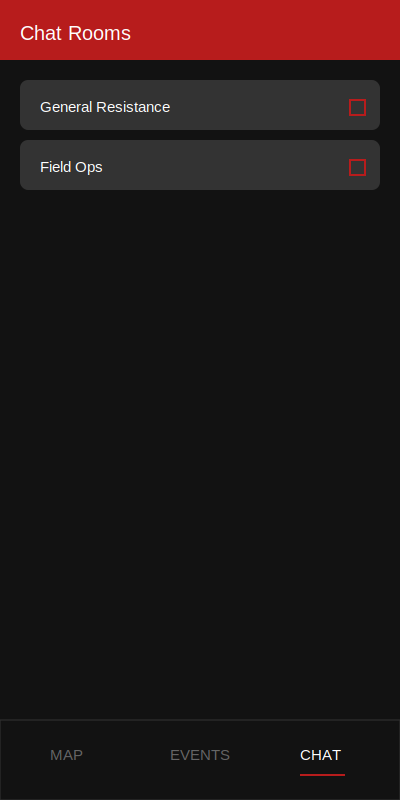
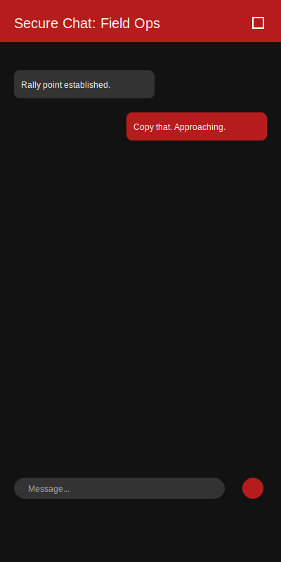
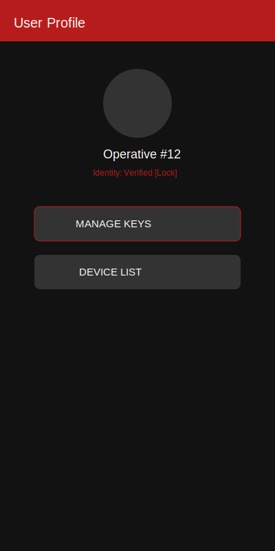
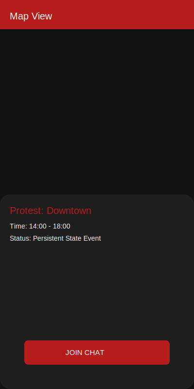
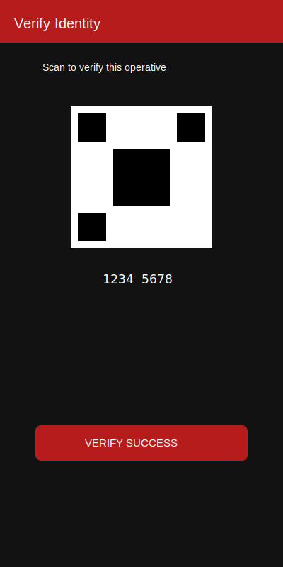

# Resistance Project: System Design Document

This document provides a comprehensive expansion of the architectural standards, security protocols, and UI design patterns for the Resistance project.

---

## 1. Core Architecture

### 1.1 Flutter Framework (Material 3)
The application is built using the Flutter framework, leveraging Material 3 design principles to provide a modern, responsive, and high-performance user experience across mobile platforms.

### 1.2 "Offline-First" Philosophy
To ensure reliability in environments with intermittent connectivity, the application follows an "offline-first" strategy.
- All critical data is cached locally.
- UI components render data from the local SQLite database immediately.
- Background processes handle synchronization with the Matrix homeserver when connectivity is restored.

### 1.3 Matrix Protocol Integration
Communication and data synchronization are handled via the Matrix protocol.
- **Library:** `matrix` for core protocol handling.
- **Encryption:** `flutter_vodozemac` for hardware-backed, E2EE (End-to-End Encryption) using Olm and Megolm ratchets.

---

## 2. Security & Privacy

### 2.1 Mandatory End-to-End Encryption (E2EE)
Privacy is a foundational mandate. All chat rooms and data-sharing channels must employ E2EE.
- **Ratchets:** Olm (one-to-one) and Megolm (group) ratchets are mandatory.
- **Verification:** Users must perform cryptographic device verification (cross-signing) to ensure identity integrity.

### 2.2 Secure Communication & Privacy
The application utilizes the **Matrix protocol** for decentralized, end-to-end encrypted communication. All data, including protest events and chat rooms, is secured with Olm/Megolm encryption.
This ensures that the application only processes and displays content relevant to the project's decentralized network.

### 2.3 Metadata Leakage Mitigation
The system is designed to minimize metadata leakage. Communication defaults to E2EE, and sensitive data is never transmitted via third-party notification services.

---

## 3. Data Strategy

### 3.1 Protest Events as Matrix State Events
Protest events are not stored in traditional databases but are managed as persistent Matrix state events (`chat.resistance.protest_event`). This allows for decentralized, verifiable, and censorship-resistant event management.

### 3.2 Local Persistence (SQLite)
`sqflite` is used for robust local storage.
- Stores encrypted message content, event metadata, and user preferences.
- Enables immediate UI rendering without waiting for network responses.

### 3.3 Push Notifications (FCM)
Firebase Cloud Messaging (FCM) is used exclusively as a "wake-up" ping.
- The payload contains no sensitive information.
- Upon receiving a ping, the application initiates a Matrix `/sync` process to retrieve new encrypted data directly from the homeserver.

---

## 4. UI Design & Consistency

### 4.1 Aesthetic: "Resistance Red"
The application uses a high-contrast theme focused on accessibility and urgency.
- **Primary Color:** `Color(0xFFB71C1C)` (Resistance Red).
- **Theme Support:** Mandatory Dark and White themes.

### 4.2 Navigation Structure
A persistent bottom navigation bar provides quick access to the three core functional areas:
1. **Map:** Geospatial visualization of protest events.
2. **Events:** Detailed list of ongoing and upcoming activities.
3. **Chat:** Secure, encrypted communication channels.

### 4.3 UI Component Standards
- **Event Metadata:** Displayed using `showModalBottomSheet` for a non-intrusive yet accessible experience.
- **Security Indicators:** Every chat room and verified identity must feature a visible "Lock" icon or cryptographic status badge.

---

## 5. Visual Mockups

Below are the conceptual designs for the primary screens of the Resistance application.

### 5.1 Main Map View
Visualizes events geographically with high-contrast markers.

### 5.2 Events List
A detailed view of all scoped protest events.

### 5.3 Chat Rooms List
Navigation through the different secure channels.

### 5.4 Secure Chat
The active communication interface with mandatory encryption indicators.

### 5.5 User Profile
Management of user identity and cryptographic verification status.

### 5.6 Event Details Modal
The contextual metadata panel for selected events.

### 5.7 Identity Verification
The process for verifying device authenticity and cross-signing.

---

## 6. Infrastructure

### 6.1 Matrix Homeserver
A dockerized Synapse homeserver serves as the backbone.
- **Access:** Exposed via Cloudflare Tunnels to provide secure, hidden routing.
- **Security:** Mandatory TLS 1.3 for all client-server communication.

### 6.2 CI/CD
Automated testing ensures cryptographic state transitions are functional before deployment.
